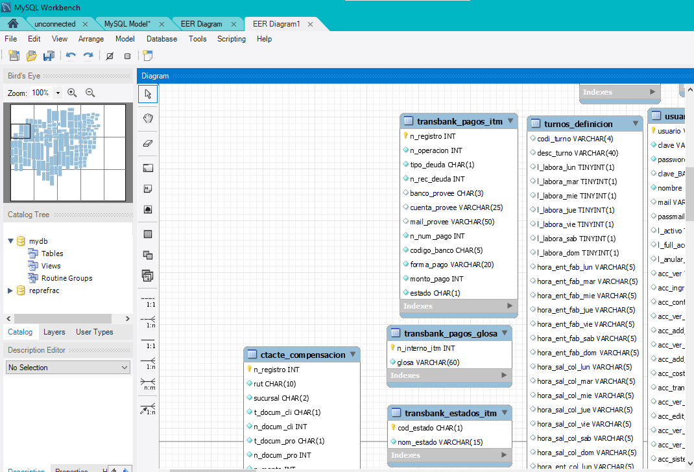

# Diagrama DB
El diagrama se creo en base del schema de la base de datos pero no existen relaciones especificas en la base de datos por lo que hay que organizar la informacion entre las tablas.
Falta organizar y hacer la documntacion completa

