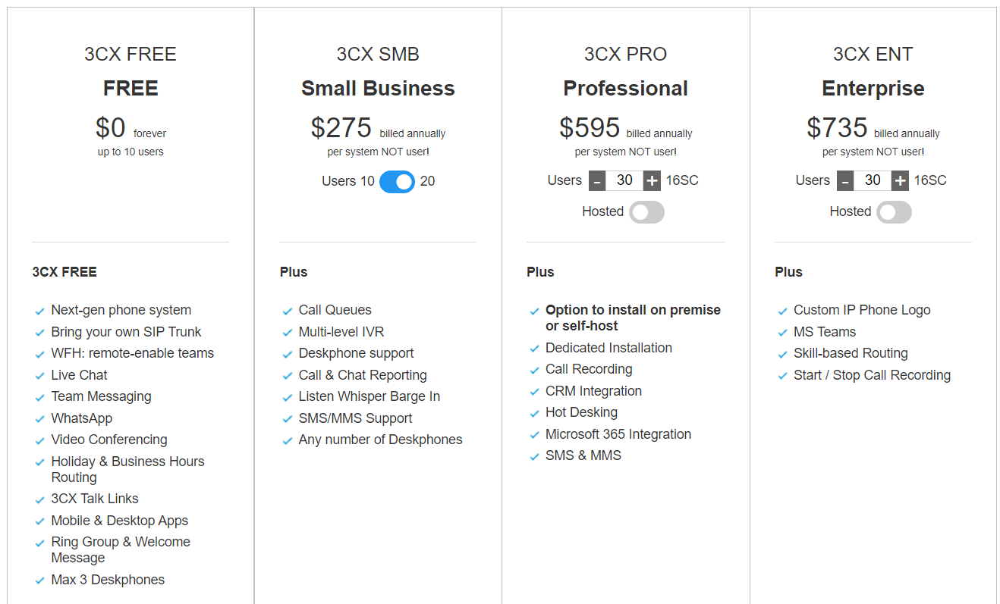
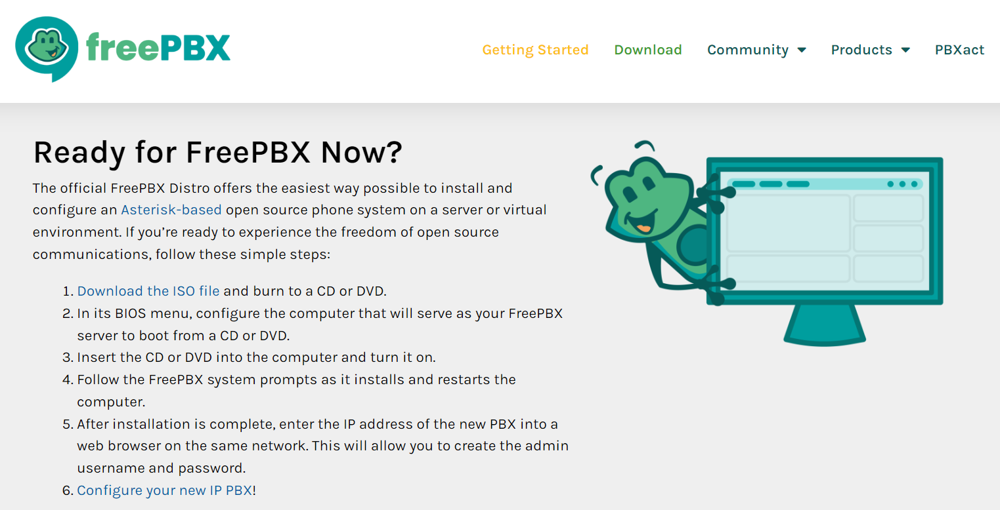
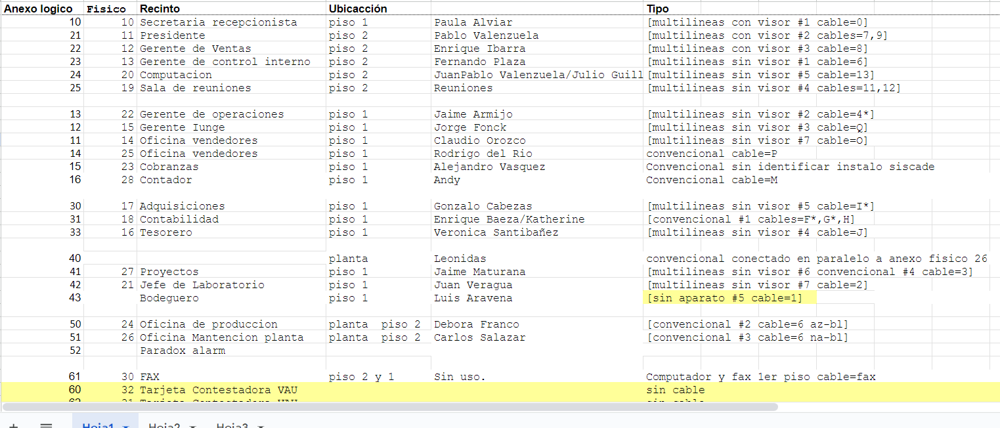
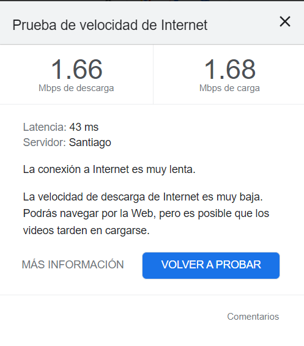

# Tarea 6: Central telefonica

costos actuales: 63.426

## Opciones de PBX
Asterisk es un framework para aplicaciones de comunicación
- [Asterisk](https://www.asterisk.org/)

Softwere gratis recomendado por asterisk.
- [FreePBX](https://www.freepbx.org/get-started/)

Tambien esta la opcion que recomienda el tecnico de GTD
- [Mikrotik](https://configurarmikrotikwireless.com/blog/priorizar-voip-con-mikrotik.html)

## Cotización externa 

### iContel

Cotización en iContel [Ver Documento](Files/Telefonia_IP_arriendo.pdf).

Cotización de venta en iContel [Ver Documento](Files/Telefonia_IP_Vta.pdf).

### GTD
Falta que llegue 

### Orbyta
Falta que llegue 

## Instalación interna

1. Evaluación de la red

El primer paso es evaluar la red de la empresa para determinar si es compatible con la telefonía IP. La red debe tener una conexión a Internet con suficiente ancho de banda para soportar el tráfico de voz. Además, es recomendable que la red esté cableada con cable Ethernet de categoría 5 o superior.

2. Selección del equipo

El siguiente paso es seleccionar el equipo necesario para la instalación. El equipo básico consiste en una central telefónica IP, teléfonos IP y, en algunos casos, gateways para conectar líneas telefónicas analógicas o digitales.

Yealink SIP-T30P [Link](https://www.winpy.cl/venta/telefono-ip-basico-yealink-con-1-linea-2-puertos-red-10-100-poe-conferencia-5-via/?gclid=CjwKCAiAkp6tBhB5EiwANTCx1D3QOJvBC4kztsRyQXRRSNT-TxQbzk-a-KjlbSIuyhu4zGPdexRR7hoCS8oQAvD_BwE).

3. Instalación de la central telefónica

La instalación de la central telefónica IP suele ser realizada por un proveedor de servicios de telefonía IP. La central telefónica se conecta a la red y se configura para atender las necesidades de la empresa.

Aquí existen 2 opciones, arrendar un servidor externo o hacer una maquina virtual en el servidor virtual para hacer una central teefonica con Asterisk
opcion externa

opción en server propio 

4. Instalación de los teléfonos IP

Los teléfonos IP se conectan a la red mediante cable Ethernet. En algunos casos, los teléfonos IP pueden conectarse a la red inalámbricamente.

5. Configuración de los teléfonos IP

Los teléfonos IP deben ser configurados para conectarse a la central telefónica IP(PBX). La configuración suele realizarse mediante un software de administración proporcionado por el proveedor de servicios de telefonía IP.

6. Configurción del VoIP
Actualmente, la empresa cuenta con VoIP configurado; sin embargo, al momento de instalar el PBX, es necesario re-configurar la conexión con el VoIP con la asistencia del proveedor de servicios de internet (GTD).

Detalles técnicos

A continuación se detallan algunos de los aspectos técnicos más importantes a tener en cuenta en la instalación de telefonía IP en una empresa:

Ancho de banda: El ancho de banda necesario para la telefonía IP depende del número de extensiones y del tipo de llamadas que se realicen. En general, se recomienda un ancho de banda de al menos 1 Mbps por extensión para llamadas internas y de 2 Mbps por extensión para llamadas externas. Ancho de banda actual 100 mbp.

Calidad de la conexión: La calidad de la conexión a Internet es un factor importante para garantizar una buena calidad de voz en las llamadas. La conexión debe ser estable y con un ping bajo.

Configuración de la red: La configuración de la red debe permitir la transmisión de tráfico de voz y datos de forma simultánea. Para ello, es necesario configurar la red para que use el protocolo IP.

## pros y contras

### Pros de realizar la instalación uno mismo

Coste: La instalación de telefonía IP puede ser más económica si la realiza la propia empresa.

Flexibilidad: La empresa puede elegir el equipo y la configuración que mejor se adapten a sus necesidades.

Aprendizaje: La empresa puede aprender a realizar la instalación de telefonía IP por sí misma, lo que puede ser beneficioso en caso de que necesite realizar cambios en el futuro.
Contras de realizar la instalación uno mismo

Tiempo: La instalación de telefonía IP puede llevar tiempo y esfuerzo, especialmente si la empresa no tiene experiencia en ello.

Complejidad: La instalación de telefonía IP puede ser compleja, especialmente si la empresa tiene una red grande o complejas necesidades de comunicación.

Riesgo: Si la instalación no se realiza correctamente, puede afectar al rendimiento del sistema o incluso provocar fallos.
### Pros de contratar una empresa para la instalación

Eficiencia: Las empresas especializadas en la instalación de telefonía IP tienen experiencia y conocimientos para realizar la instalación de forma rápida y eficiente.

Garantía: Las empresas suelen ofrecer garantías sobre su trabajo, por lo que la empresa está protegida en caso de problemas.

Soporte: Las empresas suelen ofrecer soporte técnico en caso de problemas con el sistema.

Contras de contratar una empresa para la instalación

Coste: Contratar una empresa para la instalación puede ser más caro que realizarla uno mismo.

Pérdida de control: La empresa pierde el control sobre la instalación, ya que la empresa especializada es la que toma las decisiones sobre el equipo y la configuración.